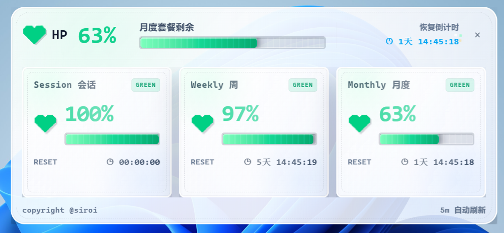

# Siroi CodeHeart

      

> 像素风 Coding Plan 生命值桌面小组件，把枯燥的 usage 数字变成一眼能读懂的 HP 血条。

Siroi CodeHeart 是一个轻量桌面工具。它会读取本机 Coding Plan 使用量数据，并以像素 RPG HUD 的形式展示 `Session`、`Weekly`、`Monthly` 三种 plan 的剩余 HP。

当额度健康时，它是一条安静的绿色 HP；当消耗升高时，它会变成黄色呼吸提示；当额度进入危险区时，它会变成红色闪烁并轻微抖动，帮助你在写代码时及时感知 Coding Plan 的消耗状态。

## 预览




## 核心功能

- **顶部悬浮 HP 小条**
  - 默认吸附在屏幕顶部。
  - 常驻显示当前最紧张的 plan 状态。
  - 支持原生拖动，松开后自动吸附回顶部。

- **像素风生命值展示**
  - 使用心形 icon 和像素血条呈现剩余额度。
  - 文本、卡片、进度条均采用像素 HUD 风格。
  - 通过颜色和动画表达状态变化。

- **三种 plan 状态**
  - `Session`
  - `Weekly`
  - `Monthly`

- **智能小条模式**
  - 默认显示三种 plan 中 **剩余 HP 最少** 的一项。
  - 支持通过右键菜单手动切换显示 `Session` / `Weekly` / `Monthly`。

- **详情窗口**
  - 点击小条展开详情窗口。
  - 再次点击小条可关闭详情窗口。
  - 详情窗口展示三种 plan 的剩余 HP、重置倒计时和状态标签。

- **系统托盘**
  - 支持最小化到托盘。
  - 托盘显示应用图标与菜单。

- **Windows 体验优化**
  - Release 构建隐藏控制台窗口。
  - 后台刷新执行 CLI 时不弹出 cmd 黑框。
  - Windows 安装器配置为中文界面。

## HP 规则

`arkcli` 返回的 `usage.percent` 表示已使用量，因此 Siroi CodeHeart 的 HP 计算规则为：

```text
HP = 100 - usage.percent
```

颜色和动画根据使用量判断：

| 使用量 | 状态 | 展示效果 |
| --- | --- | --- |
| `≤ 60%` | 绿色健康 | 满血感、稳定显示 |
| `60% - 80%` | 黄色警戒 | 残血条、缓慢呼吸渐变 |
| `> 80%` | 红色危险 | 残血条、持续闪烁、轻微抖动 |

小条默认选择三种 plan 中 **HP 最少** 的一项，也就是使用量最高、最需要关注的状态。

## 交互说明

| 操作 | 效果 |
| --- | --- |
| 点击小条 | 打开 / 关闭详情窗口 |
| 拖动小条 | 使用系统原生拖动，松开后吸附到屏幕顶部 |
| 右键小条 | 打开菜单，切换小条显示模式 |
| 点击详情窗口关闭按钮 | 关闭详情窗口 |
| 托盘菜单 | 控制显示、隐藏、退出等应用行为 |

## 前提条件

使用 Siroi CodeHeart 前，请先安装并配置好 ark-cli：

- ark-cli 官方说明：[volcengine/ark-cli README](https://github.com/volcengine/ark-cli/blob/main/README.md)
- 确保 `arkcli` 可以在系统 PATH 中直接访问。
- 确保 ark-cli 已完成登录或鉴权配置。

Siroi CodeHeart 会调用：

```bash
arkcli usage plan --product coding-plan
```

如果 `arkcli` 不存在或没有完成配置，应用会显示错误状态。

## 开发环境

如果需要本地开发，请额外准备：

- Node.js 22+
- pnpm 10+
- Rust stable
- Tauri 2 所需系统依赖

## 本地开发

安装依赖：

```bash
pnpm install
```

启动 Tauri 开发环境：

```bash
pnpm run tauri:dev
```

前端类型检查：

```bash
pnpm run typecheck
```

构建桌面应用：

```bash
pnpm run tauri:build
```

## 项目结构

```text
.
├── doc/                         # 产品截图
├── src/                         # React 前端代码
├── src-tauri/                   # Tauri / Rust 桌面端代码
│   ├── icons/                   # 应用图标
│   ├── src/                     # Rust 后端逻辑
│   └── tauri.conf.json          # Tauri 应用配置
├── .github/workflows/build.yml  # GitHub Actions 构建配置
├── package.json
└── README.md
```

## 产品定位

Siroi CodeHeart 不是一个复杂的统计后台，而是一个始终贴在桌面边缘的“小生命体”。它把 Coding Plan 的资源消耗转化成游戏化的 HP 反馈，让开发者在不打断工作流的情况下，快速判断自己的 AI 编程额度是否安全。

## License

本项目基于 [MIT License](./LICENSE) 开源。
